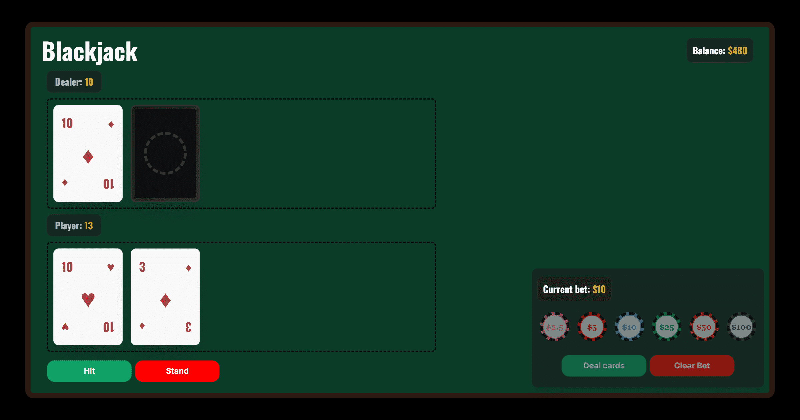

# Blackjack

A simple Blackjack game built with React, TypeScript, Vite, and Tailwind CSS.

The project simulates a classic Blackjack table where users can add virtual money, place bets, receive cards, and play against the dealer. The game does not include advanced Blackjack actions such as split, double down, insurance, or surrender.

> This project uses virtual money only. It is a game simulation and does not involve real gambling or real payments.

## Live Demo

[View the project](https://blackjack-taupe-beta.vercel.app/)

## Screenshot



## Features

- Add virtual money to start playing.
- Place bets using predefined chip values.
- Deal cards and play a classic Blackjack round.
- Use basic player actions: hit and stand.
- Dealer plays automatically after the player's turn.
- Dealer stands on 17 or higher.
- Automatic score calculation, including Ace handling.
- Blackjack, bust, win, lose, and tie outcomes.
- Balance updates after each round.
- Player money is saved in local storage.
- Responsive casino-style interface.

## How to Play

1. Add virtual money if your balance is empty.
2. Select one or more chips to place a bet.
3. Click **Deal cards** to start the round.
4. Use **Hit** to draw another card.
5. Use **Stand** to end your turn.
6. The dealer then plays automatically.
7. The result is shown and the balance is updated.
8. Start a new round and keep playing.

## Game Rules Implemented

- The goal is to get as close as possible to 21 without going over.
- Number cards keep their value.
- J, Q, and K are worth 10 points.
- Aces can count as 11 or 1, depending on the hand.
- A standard win pays 1:1.
- A Blackjack win pays 3:2.
- A tie returns the original bet.
- If the player goes over 21, the player loses the bet.
- The dealer keeps drawing cards until reaching at least 17.

## Technologies Used

- React
- TypeScript
- Vite
- Tailwind CSS
- ESLint
- Local Storage

## Project Structure

```txt
src/
├── components/       # Main game UI components
├── hooks/            # Custom hook with Blackjack state and logic
├── layout/           # Reusable layout and button components
├── logic/            # Score calculation logic
├── utils/            # Game constants and TypeScript types
├── App.tsx           # Main application component
└── main.tsx          # React entry point
```

## Getting Started

### 1. Clone the repository

```bash
git clone https://github.com/SantiG11/blackjack.git
```

### 2. Install dependencies

```bash
npm install
```

### 3. Run the development server

```bash
npm run dev
```

### 4. Build for production

```bash
npm run build
```

### 5. Preview the production build

```bash
npm run preview
```

## Available Scripts

```bash
npm run dev      # Start the development server
npm run build    # Create a production build
npm run lint     # Run ESLint
npm run preview  # Preview the production build locally
```

## Future Improvements

- Add keyboard controls.
- Add card dealing animations.
- Add sound effects.
- Add more advanced Blackjack actions such as split, double down, etc.
- Add game statistics, such as wins, losses, and total profit.
- Add unit tests for the score and game result logic.

## Author

Created by [Santiago G.](https://github.com/SantiG11)
